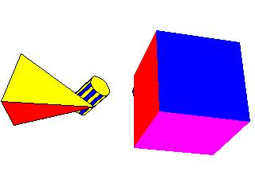



## shapes in 3D using WinAPI

### Description

this small code displays 5 shapes in 3D onto the screen by only using WinAPI fucntions...
 
### More Info
 
Press the Esc Key to exit the program

This code is only writen in a Module just open it and run it... :)

Displays 3D shapes onto the screen

After the program terminates it doesn't refresh the screen... (I didn't fix this problem on purpose because I didn't want to use a Form)

             |
---                |---
**Submitted On**   |2001-11-04 04:14:12
**By**             |[Muju](https://github.com/Planet-Source-Code/PSCIndex/blob/master/ByAuthor/muju.md)
**Level**          |Advanced
**User Rating**    |4.6 (46 globes from 10 users)
**Compatibility**  |VB 3\.0, VB 4\.0 \(16\-bit\), VB 4\.0 \(32\-bit\), VB 5\.0, VB 6\.0, VB Script, VBA MS Access, VBA MS Excel
**Category**       |[Graphics](https://github.com/Planet-Source-Code/PSCIndex/blob/master/ByCategory/graphics__1-46.md)
**World**          |[Visual Basic](https://github.com/Planet-Source-Code/PSCIndex/blob/master/ByWorld/visual-basic.md)
**Archive File**   |[shapes\_in\_331051132001\.zip](https://github.com/Planet-Source-Code/muju-shapes-in-3d-using-winapi__1-28625/archive/master.zip)

